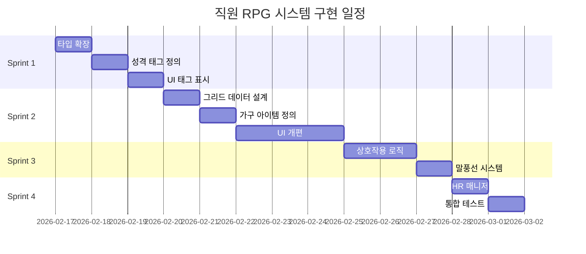
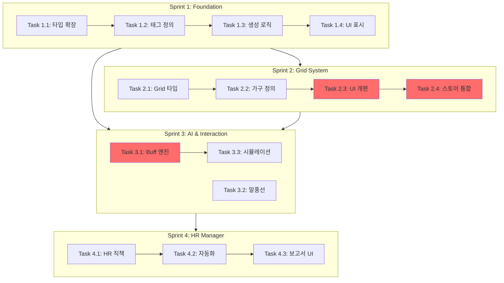

# 🏢 직원 RPG 시스템 구현 워크플로우

**프로젝트:** Retro Stock OS - Big Ambitions 스타일 직원 관리 시스템
**생성일:** 2026-02-14
**예상 기간:** 2주 (60시간)
**우선순위:** High (Sprint 2-3 통합 기능)

---

## 📋 목차

1. [기획 개요](#기획-개요)
2. [현재 코드베이스 분석](#현재-코드베이스-분석)
3. [구현 전략](#구현-전략)
4. [상세 태스크 목록](#상세-태스크-목록)
5. [의존성 다이어그램](#의존성-다이어그램)
6. [검증 체크리스트](#검증-체크리스트)
7. [위험 요소 및 대응책](#위험-요소-및-대응책)
8. [다음 단계](#다음-단계)

---

## 기획 개요

### 핵심 목표

Big Ambitions의 직원 관리 시스템을 Retro Stock OS의 2D 픽셀 환경에 맞게 경량화하여 적용합니다.
직원을 단순한 자원이 아닌 **관리해야 할 개성 있는 캐릭터**로 구현합니다.

### 주요 기능 4가지

#### 1. 직원 성격 태그 시스템 (Trait Tags)
- **목적**: 복잡한 스케줄링 대신 성격 태그로 호불호 구현
- **예시**:
  - `[야행성]`: 야간 거래 효율 +20%, 아침 실수 확률 ↑
  - `[카페인 중독]`: 커피머신 근처 배치 시 스태미너 감소 속도 절반
  - `[예민함]`: 시끄러운 직원 옆에 앉으면 스트레스 2배
  - `[워커홀릭]`: 잔업 불만 없음, 대신 월급 더 요구

#### 2. 사무실 그리드 배치 시스템 (Office Feng Shui)
- **목적**: 가구 배치 전략으로 직원 능력 최적화
- **구조**: 10x10 그리드에 가구/직원 배치
- **상호작용**:
  - **고급 의자**: 해당 자리 스태미너 회복 속도 ↑
  - **화분/공기청정기**: 주변 3x3 범위 스트레스 감소
  - **CEO 트로피**: 전 직원 충성도 버프
  - **서버 랙**: 주변 2칸 주문 속도 증가 (소음 디버프 발생)

#### 3. HR 실장 자동화 시스템
- **목적**: 대규모 직원 관리 자동화
- **기능**:
  - 자동 면담: 스트레스 높은 직원 자동 케어
  - 자동 교육: 매 분기 직원 스탯 +1~5 상승
  - 보고서: "김대리가 요즘 힘들어합니다. 휴가 보낼까요?" 팝업

#### 4. AI 말풍선 시스템 (Live Chatter)
- **목적**: 픽셀 말풍선으로 감성 추가
- **상황별 대사**:
  - 주가 폭락: "아... 내 스톡옵션 휴지조각 되나..."
  - 수익 실현: "오늘 회식 소고기인가요 실장님?!"
  - 환경 불만: "옆자리 김대리 타자 소리 너무 커..."

---

## 현재 코드베이스 분석

### 아키텍처 현황 (CLAUDE.md 기준)

```
src/
├── stores/
│   └── gameStore.ts           # Zustand 단일 스토어
├── types/
│   └── index.ts               # Employee, PlayerState 타입
├── data/
│   └── employees.ts           # 직원 생성 로직
├── engines/
│   └── tickEngine.ts          # 200ms 주기 게임 루프
└── components/
    └── windows/
        └── OfficeWindow.tsx   # 현재 리스트 뷰
```

### 현재 Employee 타입

```typescript
interface Employee {
  id: string
  name: string
  role: EmployeeRole  // analyst, trader, manager
  salary: number
  stamina: number
  hiredAt: number     // 고용 시점 (틱)
}
```

### 현재 OfficeWindow 구조

- **UI**: 직원 목록을 리스트로 표시
- **기능**: 고용, 해고, 스태미너 표시
- **크기**: ~150 LOC

### 필요한 변경 범위

| 컴포넌트 | 변경 유형 | 예상 코드량 |
|----------|-----------|-------------|
| `types/index.ts` | 확장 (Employee 타입) | +50 LOC |
| `stores/gameStore.ts` | 확장 (officeGrid 상태) | +200 LOC |
| `data/employees.ts` | 수정 (태그 부여 로직) | +30 LOC |
| `engines/tickEngine.ts` | 수정 (office 시스템 틱) | +50 LOC |
| `OfficeWindow.tsx` | **전면 재작성** | ~400 LOC (기존 150 → 400) |
| **신규 파일** | 생성 | ~2,000 LOC |
| **총계** | | ~2,730 LOC |

---

## 구현 전략

### Sprint 구조 (4 Sprints × 2주)



### Sprint 우선순위 결정 근거

1. **Sprint 1 (Foundation)**: 빠른 프로토타입으로 게임플레이 검증
   - 기존 UI 유지하면서 태그 시스템만 추가
   - 위험도 낮음, 빠른 피드백 가능

2. **Sprint 2 (Grid System)**: 가장 큰 변경, 집중 필요
   - OfficeWindow 전면 개편
   - UI/UX 사용성 검증 필수

3. **Sprint 3 (AI & Fun)**: 재미 요소 추가
   - 상호작용, 말풍선으로 몰입감 증대
   - Sprint 2 완료 후 진행 (그리드 필요)

4. **Sprint 4 (Automation)**: 후반 편의성 기능
   - 대규모 직원 관리 시나리오 대응
   - 선택적 기능 (MVP 아님)

---

## 상세 태스크 목록

### Sprint 1: Core Foundation (3일, 12시간)

#### Task 1.1: Employee 타입 확장 (4시간)
**파일**: `src/types/index.ts`

**변경 내용**:
```typescript
// ✨ 신규 타입 정의
type EmployeeTrait =
  | 'nocturnal'        // 야행성
  | 'caffeine_addict'  // 카페인 중독
  | 'sensitive'        // 예민함
  | 'workaholic'       // 워커홀릭
  | 'perfectionist'    // 완벽주의자
  | 'social'           // 사교적
  | 'introvert'        // 내향적
  | 'tech_savvy'       // 기술 능숙
  | 'risk_averse'      // 위험 회피
  | 'ambitious'        // 야심가

interface EmployeeSkills {
  analysis: number      // 분석 능력 (0-100)
  trading: number       // 거래 속도 (0-100)
  research: number      // 리서치 품질 (0-100)
}

// ✨ Employee 타입 확장
interface Employee {
  id: string
  name: string
  role: EmployeeRole
  salary: number
  stamina: number
  hiredAt: number

  // ✨ 신규 필드 (선택적 속성으로 하위 호환성 유지)
  traits?: EmployeeTrait[]       // 성격 태그 (1-2개)
  seatIndex?: number | null      // 그리드 좌표 (null = 미배치)
  stress?: number                // 스트레스 (0-100)
  satisfaction?: number          // 만족도 (0-100)
  skills?: EmployeeSkills        // 스킬 스탯
}
```

**검증**:
- [ ] `npm run build` 에러 없음
- [ ] 기존 코드에서 Employee 타입 사용 부분 컴파일 통과

---

#### Task 1.2: 성격 태그 데이터 정의 (3시간)
**파일**: `src/data/traits.ts` (신규 생성)

**구조**:
```typescript
interface TraitConfig {
  name: string
  description: string
  icon: string
  effects: TraitEffect
  rarity: 'common' | 'uncommon' | 'rare'
}

interface TraitEffect {
  // 직접 효과
  staminaRecovery?: number      // 스태미너 회복 속도 배율
  stressGeneration?: number     // 스트레스 생성 속도 배율
  skillGrowth?: number          // 스킬 성장 속도 배율

  // 조건부 효과
  nightShiftBonus?: number      // 야간 근무 효율
  morningPenalty?: number       // 오전 패널티
  noiseIntolerance?: number     // 소음 민감도

  // 요구사항
  requiresCoffee?: boolean      // 커피머신 필요
  requiresQuiet?: boolean       // 조용한 환경 필요
  salaryMultiplier?: number     // 월급 배율
}

// 10가지 성격 태그 정의
export const TRAIT_DEFINITIONS: Record<EmployeeTrait, TraitConfig> = {
  nocturnal: {
    name: '야행성',
    description: '밤에 더 집중하는 올빼미형 인간',
    icon: '🦉',
    rarity: 'common',
    effects: {
      nightShiftBonus: 0.2,      // 야간 (18:00-06:00) 거래 효율 +20%
      morningPenalty: 0.15,      // 오전 (06:00-12:00) 실수 확률 +15%
      stressGeneration: 0.9      // 야간 근무 시 스트레스 감소
    }
  },

  caffeine_addict: {
    name: '카페인 중독',
    description: '커피 없이는 못 사는 직장인',
    icon: '☕',
    rarity: 'common',
    effects: {
      requiresCoffee: true,
      staminaRecovery: 1.5,      // 커피머신 근처 시 회복 속도 1.5배
      stressGeneration: 1.3      // 커피 없으면 스트레스 1.3배
    }
  },

  sensitive: {
    name: '예민함',
    description: '환경에 민감한 섬세한 영혼',
    icon: '😰',
    rarity: 'uncommon',
    effects: {
      noiseIntolerance: 2.0,     // 소음 디버프 2배
      requiresQuiet: true,
      stressGeneration: 1.2,     // 기본 스트레스 증가 속도 1.2배
      skillGrowth: 1.1           // 조용한 환경에서 스킬 성장 1.1배
    }
  },

  workaholic: {
    name: '워커홀릭',
    description: '일 중독자, 잔업도 기꺼이',
    icon: '💼',
    rarity: 'rare',
    effects: {
      staminaRecovery: 0.8,      // 회복 속도 느림
      stressGeneration: 0.7,     // 야근해도 스트레스 적음
      salaryMultiplier: 1.3,     // 월급 30% 더 요구
      skillGrowth: 1.2           // 스킬 성장 빠름
    }
  },

  // ... 나머지 6가지 태그 정의
  // perfectionist, social, introvert, tech_savvy, risk_averse, ambitious
}
```

**검증**:
- [ ] 모든 태그에 icon, effects 정의 완료
- [ ] 효과 밸런스 검토 (너무 강력하지 않은지)

---

#### Task 1.3: 직원 생성 로직에 태그 부여 (2시간)
**파일**: `src/data/employees.ts`

**변경 내용**:
```typescript
import { TRAIT_DEFINITIONS } from './traits'

// 기존 generateEmployee() 함수 수정
export function generateEmployee(role: EmployeeRole): Employee {
  // ... 기존 로직

  // ✨ 성격 태그 랜덤 부여 (1-2개)
  const traits = generateRandomTraits()

  // ✨ 초기 스킬 설정 (role에 따라)
  const skills = generateInitialSkills(role, traits)

  return {
    id: generateId(),
    name: generateName(),
    role,
    salary: calculateSalary(role, traits),  // 태그에 따라 월급 조정
    stamina: 100,
    hiredAt: 0,

    // ✨ 신규 필드
    traits,
    seatIndex: null,
    stress: 0,
    satisfaction: 100,
    skills
  }
}

function generateRandomTraits(): EmployeeTrait[] {
  const allTraits = Object.keys(TRAIT_DEFINITIONS) as EmployeeTrait[]
  const count = Math.random() > 0.7 ? 2 : 1  // 30% 확률로 2개

  // 가중치 기반 랜덤 선택 (rare < uncommon < common)
  const weighted = allTraits.flatMap(trait => {
    const rarity = TRAIT_DEFINITIONS[trait].rarity
    const weight = rarity === 'common' ? 3 : rarity === 'uncommon' ? 2 : 1
    return Array(weight).fill(trait)
  })

  // 중복 없이 선택
  const selected: EmployeeTrait[] = []
  while (selected.length < count) {
    const trait = weighted[Math.floor(Math.random() * weighted.length)]
    if (!selected.includes(trait)) selected.push(trait)
  }

  return selected
}

function generateInitialSkills(
  role: EmployeeRole,
  traits: EmployeeTrait[]
): EmployeeSkills {
  const base = {
    analyst: { analysis: 60, trading: 30, research: 70 },
    trader: { analysis: 30, trading: 70, research: 40 },
    manager: { analysis: 50, trading: 50, research: 50 }
  }[role]

  // tech_savvy 태그 있으면 모든 스킬 +10
  if (traits.includes('tech_savvy')) {
    base.analysis += 10
    base.trading += 10
    base.research += 10
  }

  return base
}
```

**검증**:
- [ ] 신규 직원 생성 시 태그 자동 부여
- [ ] 태그 분포 확인 (common > uncommon > rare)
- [ ] 월급 계산 정상 동작

---

#### Task 1.4: OfficeWindow에 태그 표시 (3시간)
**파일**: `src/components/windows/OfficeWindow.tsx`

**변경 내용**:
```tsx
import { TRAIT_DEFINITIONS } from '@/data/traits'

// 기존 리스트 뷰에 태그 아이콘 추가
function EmployeeListItem({ employee }: { employee: Employee }) {
  const traits = employee.traits || []

  return (
    <div className="employee-item">
      <span className="name">{employee.name}</span>
      <span className="role">{employee.role}</span>

      {/* ✨ 태그 아이콘 추가 */}
      <div className="traits">
        {traits.map(trait => (
          <Tooltip key={trait} content={getTraitTooltip(trait)}>
            <span className="trait-icon">
              {TRAIT_DEFINITIONS[trait].icon}
            </span>
          </Tooltip>
        ))}
      </div>

      <StaminaBar value={employee.stamina} />
    </div>
  )
}

function getTraitTooltip(trait: EmployeeTrait): string {
  const config = TRAIT_DEFINITIONS[trait]
  const effects = Object.entries(config.effects)
    .map(([key, value]) => `${key}: ${value > 1 ? '+' : ''}${((value - 1) * 100).toFixed(0)}%`)
    .join('\n')

  return `${config.name}\n${config.description}\n\n효과:\n${effects}`
}
```

**검증**:
- [ ] 직원 목록에 태그 아이콘 표시
- [ ] 호버 시 툴팁 정상 동작
- [ ] 성능 문제 없음 (100명 직원 렌더링)

---

### Sprint 2: Grid System (5일, 31시간)

#### Task 2.1: Office Grid 데이터 구조 설계 (4시간)
**파일**: `src/types/office.ts` (신규 생성)

**전체 구조**:
```typescript
// 가구 타입
export type FurnitureType =
  | 'desk'              // 책상 (기본 배치)
  | 'premium_chair'     // 고급 의자
  | 'plant'             // 화분
  | 'server_rack'       // 서버 랙
  | 'coffee_machine'    // 커피머신
  | 'trophy'            // CEO 트로피
  | 'air_purifier'      // 공기청정기
  | 'whiteboard'        // 화이트보드
  | 'bookshelf'         // 책장
  | 'lounge_chair'      // 휴게 의자

// 버프 효과 타입
export interface BuffEffect {
  type: 'stamina_recovery' | 'stress_reduction' | 'skill_growth' | 'trading_speed' | 'morale'
  value: number         // 배율 (1.0 = 100%)
  range: number         // 영향 범위 (칸 수, 0 = 해당 칸만)
}

// 가구 아이템
export interface FurnitureItem {
  id: string
  type: FurnitureType
  position: { x: number; y: number }
  size: { width: number; height: number }  // 그리드 칸 수
  buffs: BuffEffect[]
  cost: number          // 구매 비용
  sprite?: string       // 스프라이트 이미지 경로
}

// 그리드 셀
export interface GridCell {
  x: number
  y: number
  occupiedBy: string | null   // furniture ID or employee ID
  type: 'empty' | 'desk' | 'furniture' | 'wall'
  buffs: BuffEffect[]          // 해당 칸에 영향을 주는 버프 목록 (계산됨)
}

// 사무실 그리드
export interface OfficeGrid {
  size: { width: number; height: number }  // 기본 10x10
  cells: GridCell[][]                      // 2D 배열
  furniture: FurnitureItem[]               // 배치된 가구 목록
}
```

**검증**:
- [ ] 타입 정의 완료
- [ ] 다른 타입과 충돌 없음

---

#### Task 2.2: 가구 아이템 정의 (5시간)
**파일**: `src/data/furniture.ts` (신규 생성)

**카탈로그 정의**:
```typescript
import { FurnitureType, BuffEffect } from '@/types/office'

interface FurnitureCatalogItem {
  type: FurnitureType
  name: string
  description: string
  cost: number
  size: { width: number; height: number }
  buffs: BuffEffect[]
  sprite: string
  unlockLevel?: number  // 특정 레벨부터 구매 가능
}

export const FURNITURE_CATALOG: Record<FurnitureType, FurnitureCatalogItem> = {
  desk: {
    type: 'desk',
    name: '기본 책상',
    description: '직원이 앉을 수 있는 기본 책상',
    cost: 10000,
    size: { width: 1, height: 1 },
    buffs: [],
    sprite: 'desk_basic.png'
  },

  premium_chair: {
    type: 'premium_chair',
    name: '고급 의자',
    description: '인체공학 의자로 스태미너 회복 속도 증가',
    cost: 50000,
    size: { width: 1, height: 1 },
    buffs: [
      { type: 'stamina_recovery', value: 1.5, range: 0 }  // 해당 칸만
    ],
    sprite: 'chair_premium.png'
  },

  plant: {
    type: 'plant',
    name: '대형 화분',
    description: '주변 3칸 범위 직원 스트레스 감소',
    cost: 10000,
    size: { width: 1, height: 1 },
    buffs: [
      { type: 'stress_reduction', value: 0.8, range: 3 }  // 3칸 범위
    ],
    sprite: 'plant.png'
  },

  server_rack: {
    type: 'server_rack',
    name: '고성능 서버',
    description: '주변 2칸 거래 속도 증가 (소음 발생)',
    cost: 200000,
    size: { width: 2, height: 1 },
    buffs: [
      { type: 'trading_speed', value: 1.2, range: 2 },
      { type: 'stress_reduction', value: 1.3, range: 2 }  // 소음으로 스트레스 증가
    ],
    sprite: 'server_rack.png',
    unlockLevel: 5
  },

  coffee_machine: {
    type: 'coffee_machine',
    name: '에스프레소 머신',
    description: '주변 2칸 스태미너 회복 증가 (카페인 중독 필수)',
    cost: 80000,
    size: { width: 1, height: 1 },
    buffs: [
      { type: 'stamina_recovery', value: 1.3, range: 2 }
    ],
    sprite: 'coffee_machine.png'
  },

  trophy: {
    type: 'trophy',
    name: 'CEO 트로피',
    description: '전 직원 사기 증진 (시야 내 배치)',
    cost: 150000,
    size: { width: 1, height: 1 },
    buffs: [
      { type: 'morale', value: 1.1, range: 999 }  // 전체 범위
    ],
    sprite: 'trophy.png',
    unlockLevel: 10
  },

  air_purifier: {
    type: 'air_purifier',
    name: '공기청정기',
    description: '주변 3칸 스트레스 감소 및 쾌적함 증가',
    cost: 120000,
    size: { width: 1, height: 1 },
    buffs: [
      { type: 'stress_reduction', value: 0.85, range: 3 }
    ],
    sprite: 'air_purifier.png'
  },

  whiteboard: {
    type: 'whiteboard',
    name: '화이트보드',
    description: '주변 2칸 스킬 성장 속도 증가',
    cost: 30000,
    size: { width: 2, height: 1 },
    buffs: [
      { type: 'skill_growth', value: 1.15, range: 2 }
    ],
    sprite: 'whiteboard.png'
  },

  bookshelf: {
    type: 'bookshelf',
    name: '서가',
    description: '주변 2칸 분석 스킬 성장 증가',
    cost: 40000,
    size: { width: 1, height: 1 },
    buffs: [
      { type: 'skill_growth', value: 1.1, range: 2 }
    ],
    sprite: 'bookshelf.png'
  },

  lounge_chair: {
    type: 'lounge_chair',
    name: '휴게 소파',
    description: '주변 1칸 스트레스 감소 및 스태미너 회복',
    cost: 60000,
    size: { width: 2, height: 1 },
    buffs: [
      { type: 'stress_reduction', value: 0.7, range: 1 },
      { type: 'stamina_recovery', value: 1.2, range: 1 }
    ],
    sprite: 'lounge_chair.png'
  }
}

// 가구 구매 가능 여부 체크
export function canBuyFurniture(
  type: FurnitureType,
  playerLevel: number,
  playerCash: number
): { canBuy: boolean; reason?: string } {
  const item = FURNITURE_CATALOG[type]

  if (item.unlockLevel && playerLevel < item.unlockLevel) {
    return {
      canBuy: false,
      reason: `레벨 ${item.unlockLevel} 이상 필요`
    }
  }

  if (playerCash < item.cost) {
    return {
      canBuy: false,
      reason: `자금 부족 (${item.cost.toLocaleString()}원 필요)`
    }
  }

  return { canBuy: true }
}
```

**검증**:
- [ ] 10가지 가구 정의 완료
- [ ] 버프 효과 밸런스 검토
- [ ] 비용 밸런스 검토 (게임 경제 고려)

---

#### Task 2.3: OfficeWindow UI 개편 (16시간) 🔴 **CRITICAL**
**파일**: `src/components/windows/OfficeWindow.tsx`

**새로운 구조**:
```tsx
import { OfficeGrid } from '@/components/office/OfficeGrid'
import { FurnitureShop } from '@/components/office/FurnitureShop'
import { EmployeePanel } from '@/components/office/EmployeePanel'

export function OfficeWindow() {
  const [selectedFurniture, setSelectedFurniture] = useState<FurnitureType | null>(null)
  const [selectedEmployee, setSelectedEmployee] = useState<string | null>(null)

  return (
    <WindowFrame title="사무실 관리" icon="office">
      <div className="office-container">
        {/* 좌측: 그리드 뷰 */}
        <div className="grid-section">
          <OfficeGrid
            selectedFurniture={selectedFurniture}
            selectedEmployee={selectedEmployee}
            onCellClick={handleCellClick}
          />
        </div>

        {/* 우측: 가구 상점 + 직원 목록 */}
        <div className="sidebar">
          <FurnitureShop
            onSelect={setSelectedFurniture}
            selected={selectedFurniture}
          />

          <EmployeePanel
            onSelect={setSelectedEmployee}
            selected={selectedEmployee}
          />
        </div>
      </div>
    </WindowFrame>
  )
}

function handleCellClick(x: number, y: number) {
  if (selectedFurniture) {
    // 가구 배치
    gameStore.getState().placeFurniture(selectedFurniture, x, y)
    setSelectedFurniture(null)
  } else if (selectedEmployee) {
    // 직원 좌석 배치
    gameStore.getState().assignEmployeeSeat(selectedEmployee, x, y)
    setSelectedEmployee(null)
  }
}
```

**하위 컴포넌트**:

1. **OfficeGrid.tsx** (신규 생성):
```tsx
export function OfficeGrid({
  selectedFurniture,
  selectedEmployee,
  onCellClick
}: OfficeGridProps) {
  const grid = useGameStore(s => s.officeGrid)

  return (
    <div
      className="office-grid"
      style={{
        display: 'grid',
        gridTemplateColumns: `repeat(${grid.size.width}, 1fr)`,
        gridTemplateRows: `repeat(${grid.size.height}, 1fr)`,
        gap: '2px'
      }}
    >
      {grid.cells.flat().map(cell => (
        <GridCell
          key={`${cell.x}-${cell.y}`}
          cell={cell}
          isSelected={isSelected(cell)}
          onClick={() => onCellClick(cell.x, cell.y)}
        />
      ))}
    </div>
  )
}

function GridCell({ cell, isSelected, onClick }: GridCellProps) {
  const furniture = useFurnitureAtCell(cell.x, cell.y)
  const employee = useEmployeeAtCell(cell.x, cell.y)

  return (
    <div
      className={cn('grid-cell', {
        'selected': isSelected,
        'occupied': cell.occupiedBy !== null
      })}
      onClick={onClick}
    >
      {furniture && <FurnitureTile item={furniture} />}
      {employee && <EmployeeTile employee={employee} />}

      {/* 버프 표시기 */}
      {cell.buffs.length > 0 && (
        <div className="buff-indicators">
          {cell.buffs.map((buff, i) => (
            <BuffIcon key={i} buff={buff} />
          ))}
        </div>
      )}
    </div>
  )
}
```

2. **FurnitureShop.tsx** (신규 생성):
```tsx
export function FurnitureShop({ onSelect, selected }: FurnitureShopProps) {
  const playerCash = useGameStore(s => s.player.cash)
  const playerLevel = useGameStore(s => calculatePlayerLevel())

  return (
    <div className="furniture-shop">
      <h3>가구 상점</h3>
      <div className="catalog">
        {Object.values(FURNITURE_CATALOG).map(item => {
          const { canBuy, reason } = canBuyFurniture(
            item.type,
            playerLevel,
            playerCash
          )

          return (
            <FurnitureCard
              key={item.type}
              item={item}
              selected={selected === item.type}
              disabled={!canBuy}
              disabledReason={reason}
              onClick={() => canBuy && onSelect(item.type)}
            />
          )
        })}
      </div>
    </div>
  )
}
```

3. **EmployeePanel.tsx** (신규 생성):
```tsx
export function EmployeePanel({ onSelect, selected }: EmployeePanelProps) {
  const employees = useGameStore(s => s.player.employees)
  const unassigned = employees.filter(e => e.seatIndex === null)

  return (
    <div className="employee-panel">
      <h3>미배치 직원 ({unassigned.length})</h3>
      <div className="employee-list">
        {unassigned.map(emp => (
          <EmployeeCard
            key={emp.id}
            employee={emp}
            selected={selected === emp.id}
            onClick={() => onSelect(emp.id)}
          />
        ))}
      </div>
    </div>
  )
}
```

**스타일링** (Tailwind CSS):
```css
.office-container {
  display: flex;
  gap: 16px;
  height: 100%;
}

.grid-section {
  flex: 1;
  background: #1a1a1a;
  padding: 16px;
  border-radius: 8px;
}

.sidebar {
  width: 300px;
  display: flex;
  flex-direction: column;
  gap: 16px;
}

.office-grid {
  width: 100%;
  aspect-ratio: 1;
  max-width: 600px;
  margin: 0 auto;
}

.grid-cell {
  position: relative;
  background: #2a2a2a;
  border: 1px solid #3a3a3a;
  cursor: pointer;
  transition: all 0.2s;
}

.grid-cell:hover {
  background: #3a3a3a;
  border-color: #4a4a4a;
}

.grid-cell.selected {
  border-color: #00ff00;
  box-shadow: 0 0 10px rgba(0, 255, 0, 0.3);
}

.grid-cell.occupied {
  background: #3a3a2a;
}
```

**검증**:
- [ ] 그리드 렌더링 성능 (60fps 유지)
- [ ] 가구 선택 → 배치 동작
- [ ] 직원 선택 → 좌석 배치 동작
- [ ] 반응형 레이아웃 (최소 1024px 너비)

---

#### Task 2.4: Zustand 스토어 통합 (6시간)
**파일**: `src/stores/gameStore.ts`

**상태 추가**:
```typescript
import { OfficeGrid, FurnitureItem } from '@/types/office'
import { FURNITURE_CATALOG } from '@/data/furniture'

interface GameStore {
  // ... 기존 필드

  // ✨ 신규 필드
  officeGrid: OfficeGrid

  // ✨ 신규 액션
  placeFurniture: (type: FurnitureType, x: number, y: number) => void
  removeFurniture: (furnitureId: string) => void
  assignEmployeeSeat: (employeeId: string, x: number, y: number) => void
  unassignEmployeeSeat: (employeeId: string) => void
  recalculateGridBuffs: () => void
}

// 초기화
function createInitialOfficeGrid(): OfficeGrid {
  const size = { width: 10, height: 10 }
  const cells: GridCell[][] = []

  for (let y = 0; y < size.height; y++) {
    cells[y] = []
    for (let x = 0; x < size.width; x++) {
      cells[y][x] = {
        x,
        y,
        occupiedBy: null,
        type: 'empty',
        buffs: []
      }
    }
  }

  return { size, cells, furniture: [] }
}

// 액션 구현
const gameStore = create<GameStore>((set, get) => ({
  // ... 기존 상태
  officeGrid: createInitialOfficeGrid(),

  // 가구 배치
  placeFurniture: (type, x, y) => {
    const catalog = FURNITURE_CATALOG[type]
    const { cash } = get().player
    const { canBuy } = canBuyFurniture(type, calculatePlayerLevel(), cash)

    if (!canBuy) return

    // 공간 확인
    if (!isSpaceAvailable(x, y, catalog.size, get().officeGrid)) {
      return
    }

    // 가구 생성
    const furniture: FurnitureItem = {
      id: generateId(),
      type,
      position: { x, y },
      size: catalog.size,
      buffs: catalog.buffs,
      cost: catalog.cost,
      sprite: catalog.sprite
    }

    set(state => {
      // 비용 차감
      state.player.cash -= catalog.cost

      // 그리드 업데이트
      const grid = state.officeGrid
      grid.furniture.push(furniture)

      // 셀 점유 처리
      for (let dy = 0; dy < catalog.size.height; dy++) {
        for (let dx = 0; dx < catalog.size.width; dx++) {
          grid.cells[y + dy][x + dx].occupiedBy = furniture.id
          grid.cells[y + dy][x + dx].type = 'furniture'
        }
      }

      return state
    })

    // 버프 재계산
    get().recalculateGridBuffs()
  },

  // 가구 제거
  removeFurniture: (furnitureId) => {
    set(state => {
      const grid = state.officeGrid
      const furniture = grid.furniture.find(f => f.id === furnitureId)
      if (!furniture) return state

      // 셀 점유 해제
      for (let dy = 0; dy < furniture.size.height; dy++) {
        for (let dx = 0; dx < furniture.size.width; dx++) {
          const cell = grid.cells[furniture.position.y + dy][furniture.position.x + dx]
          cell.occupiedBy = null
          cell.type = 'empty'
        }
      }

      // 가구 목록에서 제거
      grid.furniture = grid.furniture.filter(f => f.id !== furnitureId)

      // 비용 환불 (50%)
      state.player.cash += furniture.cost * 0.5

      return state
    })

    get().recalculateGridBuffs()
  },

  // 직원 좌석 배치
  assignEmployeeSeat: (employeeId, x, y) => {
    const cell = get().officeGrid.cells[y][x]

    // 빈 책상인지 확인
    if (cell.type !== 'desk' || cell.occupiedBy !== null) {
      return
    }

    set(state => {
      // 직원 찾기
      const employee = state.player.employees.find(e => e.id === employeeId)
      if (!employee) return state

      // 기존 좌석 해제
      if (employee.seatIndex !== null) {
        const oldCell = state.officeGrid.cells.flat()[employee.seatIndex]
        oldCell.occupiedBy = null
      }

      // 새 좌석 배치
      employee.seatIndex = y * 10 + x
      cell.occupiedBy = employeeId

      return state
    })
  },

  // 직원 좌석 해제
  unassignEmployeeSeat: (employeeId) => {
    set(state => {
      const employee = state.player.employees.find(e => e.id === employeeId)
      if (!employee || employee.seatIndex === null) return state

      const cell = state.officeGrid.cells.flat()[employee.seatIndex]
      cell.occupiedBy = null
      employee.seatIndex = null

      return state
    })
  },

  // 그리드 버프 재계산
  recalculateGridBuffs: () => {
    set(state => {
      const grid = state.officeGrid

      // 모든 셀 버프 초기화
      grid.cells.flat().forEach(cell => {
        cell.buffs = []
      })

      // 각 가구의 버프 적용
      grid.furniture.forEach(furniture => {
        furniture.buffs.forEach(buff => {
          const { x, y } = furniture.position
          const range = buff.range

          if (range === 0) {
            // 해당 칸만
            grid.cells[y][x].buffs.push(buff)
          } else if (range === 999) {
            // 전체 범위
            grid.cells.flat().forEach(cell => cell.buffs.push(buff))
          } else {
            // 범위 내 셀
            for (let dy = -range; dy <= range; dy++) {
              for (let dx = -range; dx <= range; dx++) {
                const nx = x + dx
                const ny = y + dy

                // 맨해튼 거리 체크
                if (Math.abs(dx) + Math.abs(dy) <= range &&
                    nx >= 0 && nx < grid.size.width &&
                    ny >= 0 && ny < grid.size.height) {
                  grid.cells[ny][nx].buffs.push(buff)
                }
              }
            }
          }
        })
      })

      return state
    })
  }
}))

// 유틸리티 함수
function isSpaceAvailable(
  x: number,
  y: number,
  size: { width: number; height: number },
  grid: OfficeGrid
): boolean {
  for (let dy = 0; dy < size.height; dy++) {
    for (let dx = 0; dx < size.width; dx++) {
      const nx = x + dx
      const ny = y + dy

      if (nx >= grid.size.width || ny >= grid.size.height) {
        return false
      }

      const cell = grid.cells[ny][nx]
      if (cell.occupiedBy !== null) {
        return false
      }
    }
  }

  return true
}
```

**검증**:
- [ ] 가구 배치/제거 동작
- [ ] 직원 좌석 배치/해제 동작
- [ ] 버프 재계산 정상 동작
- [ ] 저장/로드 시 그리드 상태 복원

---

### Sprint 3: AI & Interaction (3일, 12시간)

#### Task 3.1: Buff/Debuff 계산 엔진 (6시간)
**파일**: `src/systems/officeSystem.ts` (신규 생성)

**구조**:
```typescript
import { Employee, EmployeeTrait } from '@/types'
import { GridCell, BuffEffect } from '@/types/office'
import { TRAIT_DEFINITIONS } from '@/data/traits'

// 직원별 종합 버프 계산
export function calculateEmployeeBuffs(
  employee: Employee,
  seatCell: GridCell,
  adjacentEmployees: Employee[]
): EmployeeBuffs {
  const buffs: EmployeeBuffs = {
    staminaRecovery: 1.0,
    stressGeneration: 1.0,
    skillGrowth: 1.0,
    tradingSpeed: 1.0,
    morale: 1.0
  }

  // 1. 가구 버프 적용
  seatCell.buffs.forEach(buff => {
    applyBuff(buffs, buff)
  })

  // 2. 성격 태그 효과 적용
  employee.traits?.forEach(trait => {
    const config = TRAIT_DEFINITIONS[trait]
    applyTraitEffects(buffs, config, seatCell, adjacentEmployees)
  })

  // 3. 인접 직원 상호작용
  adjacentEmployees.forEach(adj => {
    applyEmployeeInteraction(buffs, employee, adj)
  })

  return buffs
}

function applyBuff(buffs: EmployeeBuffs, buff: BuffEffect) {
  switch (buff.type) {
    case 'stamina_recovery':
      buffs.staminaRecovery *= buff.value
      break
    case 'stress_reduction':
      buffs.stressGeneration *= buff.value
      break
    case 'skill_growth':
      buffs.skillGrowth *= buff.value
      break
    case 'trading_speed':
      buffs.tradingSpeed *= buff.value
      break
    case 'morale':
      buffs.morale *= buff.value
      break
  }
}

function applyTraitEffects(
  buffs: EmployeeBuffs,
  traitConfig: TraitConfig,
  seatCell: GridCell,
  adjacentEmployees: Employee[]
) {
  const effects = traitConfig.effects

  // 기본 효과
  if (effects.staminaRecovery) {
    buffs.staminaRecovery *= effects.staminaRecovery
  }
  if (effects.stressGeneration) {
    buffs.stressGeneration *= effects.stressGeneration
  }
  if (effects.skillGrowth) {
    buffs.skillGrowth *= effects.skillGrowth
  }

  // 조건부 효과
  if (effects.requiresCoffee) {
    const hasCoffee = seatCell.buffs.some(b =>
      b.type === 'stamina_recovery' && b.value > 1.0
    )
    if (!hasCoffee) {
      buffs.stressGeneration *= 1.3  // 커피 없으면 스트레스 증가
    }
  }

  if (effects.noiseIntolerance) {
    const hasNoise = seatCell.buffs.some(b =>
      b.type === 'trading_speed' && b.value > 1.0  // 서버 랙 = 소음
    )
    if (hasNoise) {
      buffs.stressGeneration *= effects.noiseIntolerance
    }
  }

  if (effects.requiresQuiet) {
    const noisyNeighbors = adjacentEmployees.filter(e =>
      e.role === 'trader'  // 트레이더는 시끄러움
    )
    if (noisyNeighbors.length > 0) {
      buffs.stressGeneration *= 1.5
    }
  }
}

function applyEmployeeInteraction(
  buffs: EmployeeBuffs,
  employee: Employee,
  adjacent: Employee
) {
  // sensitive + 시끄러운 직원
  if (employee.traits?.includes('sensitive') && adjacent.role === 'trader') {
    buffs.stressGeneration *= 2.0
  }

  // social + 다른 직원
  if (employee.traits?.includes('social')) {
    buffs.morale *= 1.05  // 인접 직원당 5% 증가
  }

  // introvert + 많은 직원
  if (employee.traits?.includes('introvert') && adjacentEmployees.length > 2) {
    buffs.stressGeneration *= 1.2
  }
}

// 틱마다 호출되는 업데이트 함수
export function updateOfficeSystem(state: GameStore) {
  const { officeGrid, player } = state

  player.employees.forEach(employee => {
    if (employee.seatIndex === null) return

    const seatCell = officeGrid.cells.flat()[employee.seatIndex]
    const adjacentEmployees = getAdjacentEmployees(
      employee.seatIndex,
      player.employees,
      officeGrid
    )

    const buffs = calculateEmployeeBuffs(employee, seatCell, adjacentEmployees)

    // 스태미너 회복
    employee.stamina = Math.min(
      100,
      employee.stamina + 0.1 * buffs.staminaRecovery
    )

    // 스트레스 증가
    employee.stress = Math.min(
      100,
      (employee.stress || 0) + 0.05 * buffs.stressGeneration
    )

    // 만족도 계산
    const targetStress = 30  // 목표 스트레스
    const stressDiff = (employee.stress || 0) - targetStress
    const satisfactionChange = -stressDiff * 0.01

    employee.satisfaction = Math.max(
      0,
      Math.min(100, (employee.satisfaction || 100) + satisfactionChange)
    )

    // 퇴사 체크
    if (employee.satisfaction < 20) {
      // 경고 알림
      state.addNewsItem({
        id: generateId(),
        title: `${employee.name} 퇴사 위기`,
        content: `만족도가 매우 낮습니다. 환경 개선이 필요합니다.`,
        severity: 'warning',
        timestamp: state.time.tick
      })
    }

    if (employee.satisfaction < 10) {
      // 자동 퇴사
      state.fireEmployee(employee.id)
      state.addNewsItem({
        id: generateId(),
        title: `${employee.name} 퇴사`,
        content: `낮은 만족도로 인해 퇴사했습니다.`,
        severity: 'negative',
        timestamp: state.time.tick
      })
    }
  })
}

function getAdjacentEmployees(
  seatIndex: number,
  allEmployees: Employee[],
  grid: OfficeGrid
): Employee[] {
  const x = seatIndex % grid.size.width
  const y = Math.floor(seatIndex / grid.size.width)

  const adjacent: Employee[] = []
  const directions = [
    { dx: -1, dy: 0 },
    { dx: 1, dy: 0 },
    { dx: 0, dy: -1 },
    { dx: 0, dy: 1 }
  ]

  directions.forEach(({ dx, dy }) => {
    const nx = x + dx
    const ny = y + dy

    if (nx >= 0 && nx < grid.size.width &&
        ny >= 0 && ny < grid.size.height) {
      const cell = grid.cells[ny][nx]
      if (cell.occupiedBy) {
        const emp = allEmployees.find(e => e.id === cell.occupiedBy)
        if (emp) adjacent.push(emp)
      }
    }
  })

  return adjacent
}
```

**tickEngine 통합**:
```typescript
// src/engines/tickEngine.ts에 추가
import { updateOfficeSystem } from '@/systems/officeSystem'

function tick() {
  // ... 기존 로직

  // ✨ 매 틱마다 사무실 시스템 업데이트
  updateOfficeSystem(gameStore.getState())
}
```

**검증**:
- [ ] 버프 계산 정상 동작
- [ ] 스트레스/만족도 시뮬레이션 동작
- [ ] 퇴사 로직 동작
- [ ] 성능 문제 없음 (100명 직원)

---

#### Task 3.2: 말풍선 시스템 (4시간)
**파일**:
- `src/data/chatter.ts` (대사 데이터)
- `src/components/office/ChatBubble.tsx` (UI 컴포넌트)

**대사 데이터**:
```typescript
// src/data/chatter.ts
export interface ChatterTemplate {
  id: string
  category: 'market' | 'stress' | 'satisfaction' | 'event' | 'random'
  condition: (employee: Employee, gameState: GameStore) => boolean
  messages: string[]
  priority: number  // 높을수록 우선순위 높음
  cooldown: number  // 재사용 대기 시간 (틱)
}

export const CHATTER_TEMPLATES: ChatterTemplate[] = [
  // 주가 관련
  {
    id: 'stock_crash',
    category: 'market',
    condition: (emp, state) => {
      const portfolio = state.player.portfolio
      const totalLoss = portfolio.reduce((sum, p) => {
        const company = state.companies.find(c => c.ticker === p.ticker)
        if (!company) return sum
        const currentValue = company.price * p.shares
        return sum + (p.avgCost * p.shares - currentValue)
      }, 0)
      return totalLoss > 100000
    },
    messages: [
      "아... 내 스톡옵션 휴지조각 되나...",
      "이번 달 실적 망했네...",
      "실장님, 이거 어떡하죠?",
      "손절 타이밍 놓쳤나봐요..."
    ],
    priority: 8,
    cooldown: 300  // 5분
  },

  {
    id: 'profit_realized',
    category: 'market',
    condition: (emp, state) => {
      // 최근 1분 내 수익 실현
      const recentProfit = state.news
        .filter(n => n.timestamp > state.time.tick - 300)
        .some(n => n.content.includes('수익 실현'))
      return recentProfit
    },
    messages: [
      "오늘 회식 소고기인가요 실장님?!",
      "와... 대박이다!",
      "이번 달 성과급 기대되는데요?",
      "실장님 짱이에요!"
    ],
    priority: 9,
    cooldown: 600
  },

  // 스트레스 관련
  {
    id: 'high_stress',
    category: 'stress',
    condition: (emp) => (emp.stress || 0) > 70,
    messages: [
      "너무 힘들다...",
      "쉬고 싶어요...",
      "머리가 깨질 것 같아요",
      "이러다 탈모 올 것 같은데..."
    ],
    priority: 7,
    cooldown: 1800
  },

  {
    id: 'noise_complaint',
    category: 'stress',
    condition: (emp, state) => {
      if (!emp.traits?.includes('sensitive') || emp.seatIndex === null) {
        return false
      }
      const adjacent = getAdjacentEmployees(emp.seatIndex, state.player.employees, state.officeGrid)
      return adjacent.some(e => e.role === 'trader')
    },
    messages: [
      "옆자리 김대리 타자 소리 너무 커...",
      "전화 좀 작게 받으시면 안 되나요?",
      "조용히 좀 해주세요...",
      "헤드셋 끼고 싶다..."
    ],
    priority: 6,
    cooldown: 900
  },

  // 만족도 관련
  {
    id: 'low_satisfaction',
    category: 'satisfaction',
    condition: (emp) => (emp.satisfaction || 100) < 40,
    messages: [
      "이직 알아봐야 하나...",
      "이 회사 미래가 있나?",
      "월급이 적어도 너무 적어...",
      "야근 수당이라도 주면 좋겠는데..."
    ],
    priority: 8,
    cooldown: 1800
  },

  {
    id: 'high_satisfaction',
    category: 'satisfaction',
    condition: (emp) => (emp.satisfaction || 100) > 80,
    messages: [
      "이 회사 분위기 좋은 것 같아요",
      "여기서 오래 다니고 싶네요",
      "실장님 덕분에 재미있게 일해요!",
      "복지가 좋아서 만족스러워요"
    ],
    priority: 5,
    cooldown: 3600
  },

  // 랜덤
  {
    id: 'random_chat',
    category: 'random',
    condition: () => Math.random() < 0.01,  // 1% 확률
    messages: [
      "점심 뭐 먹지?",
      "커피 한 잔 해야겠다",
      "오늘 날씨 좋네요",
      "주말에 뭐 하세요?",
      "이번 분기 목표 달성할 수 있을까요?",
      "주식 공부 더 해야겠어요"
    ],
    priority: 1,
    cooldown: 600
  }
]

// 대사 선택 로직
export function selectChatter(
  employee: Employee,
  gameState: GameStore,
  lastChatterTime: number
): string | null {
  const currentTick = gameState.time.tick

  // 쿨다운 체크
  if (currentTick - lastChatterTime < 300) {  // 최소 5분 간격
    return null
  }

  // 조건 맞는 대사 필터링
  const candidates = CHATTER_TEMPLATES
    .filter(t => t.condition(employee, gameState))
    .sort((a, b) => b.priority - a.priority)

  if (candidates.length === 0) return null

  // 최우선 순위 대사 선택
  const template = candidates[0]
  const message = template.messages[
    Math.floor(Math.random() * template.messages.length)
  ]

  return message
}
```

**UI 컴포넌트**:
```tsx
// src/components/office/ChatBubble.tsx
import { useEffect, useState } from 'react'
import { Employee } from '@/types'
import { selectChatter } from '@/data/chatter'
import { useGameStore } from '@/stores/gameStore'

interface ChatBubbleProps {
  employee: Employee
}

export function ChatBubble({ employee }: ChatBubbleProps) {
  const [message, setMessage] = useState<string | null>(null)
  const [lastChatterTime, setLastChatterTime] = useState(0)
  const gameState = useGameStore()

  useEffect(() => {
    // 5초마다 대사 체크
    const interval = setInterval(() => {
      const newMessage = selectChatter(employee, gameState, lastChatterTime)

      if (newMessage) {
        setMessage(newMessage)
        setLastChatterTime(gameState.time.tick)

        // 3초 후 사라짐
        setTimeout(() => setMessage(null), 3000)
      }
    }, 5000)

    return () => clearInterval(interval)
  }, [employee, gameState, lastChatterTime])

  if (!message) return null

  return (
    <div className="chat-bubble">
      <div className="bubble-content">
        {message}
      </div>
      <div className="bubble-tail" />
    </div>
  )
}
```

**스타일링**:
```css
.chat-bubble {
  position: absolute;
  top: -40px;
  left: 50%;
  transform: translateX(-50%);
  z-index: 100;
  animation: fadeIn 0.3s ease-out;
}

.bubble-content {
  background: rgba(0, 0, 0, 0.9);
  color: #fff;
  padding: 8px 12px;
  border-radius: 12px;
  font-size: 12px;
  white-space: nowrap;
  border: 1px solid rgba(255, 255, 255, 0.1);
}

.bubble-tail {
  width: 0;
  height: 0;
  border-left: 6px solid transparent;
  border-right: 6px solid transparent;
  border-top: 6px solid rgba(0, 0, 0, 0.9);
  position: absolute;
  bottom: -6px;
  left: 50%;
  transform: translateX(-50%);
}

@keyframes fadeIn {
  from {
    opacity: 0;
    transform: translateX(-50%) translateY(-10px);
  }
  to {
    opacity: 1;
    transform: translateX(-50%) translateY(0);
  }
}
```

**EmployeeTile 통합**:
```tsx
// src/components/office/EmployeeTile.tsx
export function EmployeeTile({ employee }: { employee: Employee }) {
  return (
    <div className="employee-tile">
      <div className="employee-avatar">
        {/* 아바타 이미지 */}
      </div>
      <div className="employee-name">{employee.name}</div>

      {/* ✨ 말풍선 추가 */}
      <ChatBubble employee={employee} />
    </div>
  )
}
```

**검증**:
- [ ] 대사 선택 로직 동작
- [ ] 말풍선 렌더링 및 애니메이션
- [ ] 쿨다운 정상 동작
- [ ] 성능 문제 없음 (100개 말풍선)

---

#### Task 3.3: 만족도/스트레스 시뮬레이션 통합 (2시간)
**파일**: `src/systems/officeSystem.ts` (이미 Task 3.1에서 구현됨)

**추가 검증 항목**:
- [ ] 스트레스가 100에 도달 시 자동 병가
- [ ] 만족도가 10 이하 시 자동 퇴사
- [ ] 경고 알림 UI 동작
- [ ] 30년 시뮬레이션에서 밸런스 확인

---

### Sprint 4: HR Manager (2일, 8시간)

#### Task 4.1: HR Manager 직책 추가 (3시간)
**파일**:
- `src/types/index.ts` (타입 확장)
- `src/data/employees.ts` (HR 매니저 생성)

**타입 확장**:
```typescript
// src/types/index.ts
export type EmployeeRole =
  | 'analyst'
  | 'trader'
  | 'manager'
  | 'hr_manager'  // ✨ 신규

interface Employee {
  // ... 기존 필드

  // ✨ HR 매니저 전용
  isHRManager?: boolean
  hrReports?: HRReport[]
}

interface HRReport {
  id: string
  employeeId: string
  issue: 'high_stress' | 'low_satisfaction' | 'skill_gap'
  severity: 'low' | 'medium' | 'high'
  recommendation: string
  timestamp: number
}
```

**HR 매니저 생성**:
```typescript
// src/data/employees.ts
export function generateHRManager(): Employee {
  return {
    id: generateId(),
    name: generateName(),
    role: 'hr_manager',
    salary: 5000000,  // 월급 500만원
    stamina: 100,
    hiredAt: 0,
    isHRManager: true,
    hrReports: [],
    traits: ['social', 'perfectionist'],  // 고정 태그
    seatIndex: null,
    stress: 0,
    satisfaction: 100,
    skills: {
      analysis: 70,
      trading: 30,
      research: 60
    }
  }
}
```

**고용 UI 추가**:
```tsx
// OfficeWindow.tsx에 HR 매니저 고용 버튼 추가
function HireHRManagerButton() {
  const hasHRManager = useGameStore(s =>
    s.player.employees.some(e => e.isHRManager)
  )
  const cash = useGameStore(s => s.player.cash)
  const canAfford = cash >= 10000000  // 초기 비용 1000만원

  if (hasHRManager) {
    return <div>HR 매니저 고용됨</div>
  }

  return (
    <button
      disabled={!canAfford}
      onClick={() => {
        const hrManager = generateHRManager()
        gameStore.getState().hireEmployee(hrManager)
        gameStore.getState().player.cash -= 10000000
      }}
    >
      HR 매니저 고용 (1000만원)
    </button>
  )
}
```

**검증**:
- [ ] HR 매니저 고용 가능
- [ ] 월급 정상 지급
- [ ] 타입 에러 없음

---

#### Task 4.2: 자동화 시스템 (4시간)
**파일**: `src/systems/hrAutomation.ts` (신규 생성)

**자동화 로직**:
```typescript
// src/systems/hrAutomation.ts
import { GameStore } from '@/stores/gameStore'
import { Employee, HRReport } from '@/types'

// HR 매니저 자동화 틱
export function updateHRAutomation(state: GameStore) {
  const hrManager = state.player.employees.find(e => e.isHRManager)

  if (!hrManager) return

  // 1. 스트레스 높은 직원 자동 케어
  autoStressManagement(state, hrManager)

  // 2. 스킬 자동 훈련 (매 분기 = 90일 = 324,000틱)
  if (state.time.tick % 324000 === 0) {
    autoSkillTraining(state, hrManager)
  }

  // 3. 주간 보고서 생성 (매 7일 = 25,200틱)
  if (state.time.tick % 25200 === 0) {
    generateWeeklyReport(state, hrManager)
  }
}

function autoStressManagement(state: GameStore, hrManager: Employee) {
  const highStressEmployees = state.player.employees.filter(
    e => !e.isHRManager && (e.stress || 0) > 60
  )

  highStressEmployees.forEach(emp => {
    // 자동 스트레스 감소 (비용 발생)
    const careCost = 50000  // 5만원/회

    if (state.player.cash >= careCost) {
      emp.stress = Math.max(0, (emp.stress || 0) - 20)
      state.player.cash -= careCost

      // 로그 기록
      hrManager.hrReports?.push({
        id: generateId(),
        employeeId: emp.id,
        issue: 'high_stress',
        severity: 'medium',
        recommendation: `${emp.name}에게 상담 제공 (비용: ${careCost.toLocaleString()}원)`,
        timestamp: state.time.tick
      })
    }
  })
}

function autoSkillTraining(state: GameStore, hrManager: Employee) {
  state.player.employees
    .filter(e => !e.isHRManager && e.skills)
    .forEach(emp => {
      const skills = emp.skills!
      const trainingCost = 100000  // 10만원/분기

      if (state.player.cash >= trainingCost) {
        // 랜덤 스킬 +1~5 상승
        const skillType = ['analysis', 'trading', 'research'][
          Math.floor(Math.random() * 3)
        ] as keyof EmployeeSkills

        skills[skillType] = Math.min(100, skills[skillType] + Math.floor(Math.random() * 5) + 1)

        state.player.cash -= trainingCost

        hrManager.hrReports?.push({
          id: generateId(),
          employeeId: emp.id,
          issue: 'skill_gap',
          severity: 'low',
          recommendation: `${emp.name} ${skillType} 스킬 훈련 완료`,
          timestamp: state.time.tick
        })
      }
    })
}

function generateWeeklyReport(state: GameStore, hrManager: Employee) {
  const reports = hrManager.hrReports || []

  // 최근 7일 보고서만 유지
  const weekAgo = state.time.tick - 25200
  hrManager.hrReports = reports.filter(r => r.timestamp > weekAgo)

  // 중요한 이슈 체크
  const criticalIssues = state.player.employees.filter(
    e => !e.isHRManager && ((e.stress || 0) > 80 || (e.satisfaction || 100) < 30)
  )

  if (criticalIssues.length > 0) {
    // 팝업 알림 (UI에서 처리)
    state.addHRAlert({
      id: generateId(),
      title: '주간 HR 보고서',
      content: `${criticalIssues.length}명의 직원이 긴급 관리가 필요합니다.`,
      employees: criticalIssues,
      timestamp: state.time.tick
    })
  }
}
```

**tickEngine 통합**:
```typescript
// src/engines/tickEngine.ts
import { updateHRAutomation } from '@/systems/hrAutomation'

function tick() {
  // ... 기존 로직

  // ✨ HR 자동화 업데이트
  updateHRAutomation(gameStore.getState())
}
```

**검증**:
- [ ] 자동 스트레스 관리 동작
- [ ] 자동 스킬 훈련 동작
- [ ] 비용 차감 정상 동작
- [ ] 보고서 생성 동작

---

#### Task 4.3: 보고서 UI (1시간)
**파일**: `src/components/windows/HRReportModal.tsx` (신규 생성)

**UI 구조**:
```tsx
// src/components/windows/HRReportModal.tsx
import { useGameStore } from '@/stores/gameStore'

export function HRReportModal({ alertId }: { alertId: string }) {
  const alert = useGameStore(s =>
    s.hrAlerts?.find(a => a.id === alertId)
  )

  if (!alert) return null

  return (
    <Modal title={alert.title} onClose={() => dismissAlert(alertId)}>
      <div className="hr-report">
        <p className="report-content">{alert.content}</p>

        <div className="critical-employees">
          <h4>긴급 관리 대상 직원</h4>
          {alert.employees.map(emp => (
            <EmployeeIssueCard key={emp.id} employee={emp} />
          ))}
        </div>

        <div className="actions">
          <button onClick={() => handleAutoResolve(alert)}>
            자동 처리 (비용 발생)
          </button>
          <button onClick={() => dismissAlert(alertId)}>
            나중에 처리
          </button>
        </div>
      </div>
    </Modal>
  )
}

function EmployeeIssueCard({ employee }: { employee: Employee }) {
  const stress = employee.stress || 0
  const satisfaction = employee.satisfaction || 100

  return (
    <div className="employee-issue">
      <div className="employee-info">
        <span className="name">{employee.name}</span>
        <span className="role">{employee.role}</span>
      </div>

      <div className="metrics">
        <div className={stress > 80 ? 'critical' : ''}>
          스트레스: {stress.toFixed(0)}%
        </div>
        <div className={satisfaction < 30 ? 'critical' : ''}>
          만족도: {satisfaction.toFixed(0)}%
        </div>
      </div>

      <div className="recommendation">
        {stress > 80 && '휴가 권장'}
        {satisfaction < 30 && '환경 개선 필요'}
      </div>
    </div>
  )
}

function handleAutoResolve(alert: HRAlert) {
  const totalCost = alert.employees.length * 100000  // 10만원/명

  if (confirm(`총 ${totalCost.toLocaleString()}원이 소요됩니다. 진행하시겠습니까?`)) {
    alert.employees.forEach(emp => {
      // 스트레스 감소
      emp.stress = Math.max(0, (emp.stress || 0) - 30)

      // 만족도 증가
      emp.satisfaction = Math.min(100, (emp.satisfaction || 100) + 20)
    })

    gameStore.getState().player.cash -= totalCost
    dismissAlert(alert.id)
  }
}
```

**검증**:
- [ ] 보고서 모달 렌더링
- [ ] 자동 처리 동작
- [ ] 비용 차감 정상 동작
- [ ] UI/UX 직관적

---

## 의존성 다이어그램



**병렬 실행 가능 구간**:
- **Group A**: Task 1.1, 1.2 (병렬)
- **Group B**: Task 2.1, 2.2 (병렬)
- **Group C**: Task 3.2, 4.1 (서로 독립)

---

## 검증 체크리스트

### Sprint 1 검증
- [ ] 신규 직원 생성 시 성격 태그 자동 부여
- [ ] 태그 분포 확인 (common > uncommon > rare)
- [ ] UI에 태그 아이콘 및 툴팁 표시
- [ ] 기존 저장 파일 로드 가능 (하위 호환성)
- [ ] `npm run build` 타입 에러 없음

### Sprint 2 검증
- [ ] 10x10 그리드 렌더링 성능 (60fps)
- [ ] 가구 구매 및 배치 동작
- [ ] 가구 제거 및 환불 동작
- [ ] 직원 좌석 배치/해제 동작
- [ ] 버프 재계산 정상 동작
- [ ] 저장/로드 시 그리드 상태 복원
- [ ] 반응형 레이아웃 (1024px+ 너비)

### Sprint 3 검증
- [ ] 가구 버프가 직원에게 적용됨
- [ ] 성격 태그 효과 동작 (야행성, 카페인 중독 등)
- [ ] 인접 직원 상호작용 동작 (예민함 + 시끄러운 직원)
- [ ] 스트레스/만족도 시뮬레이션 동작
- [ ] 퇴사 로직 동작 (만족도 < 10)
- [ ] 말풍선 렌더링 및 애니메이션
- [ ] 대사 선택 로직 정상 동작
- [ ] 성능 문제 없음 (100명 직원 + 말풍선)

### Sprint 4 검증
- [ ] HR 매니저 고용 및 월급 지급
- [ ] 자동 스트레스 관리 동작
- [ ] 자동 스킬 훈련 동작
- [ ] 주간 보고서 생성 및 팝업 표시
- [ ] 자동 처리 비용 차감 정상 동작
- [ ] UI/UX 직관적

### 최종 통합 검증
- [ ] **성능 테스트**: 100명 직원 + 50개 가구 → 60fps 유지
- [ ] **게임플레이 밸런스**: 30년 플레이 시뮬레이션
  - 스트레스/만족도 균형 확인
  - 가구 비용 대비 효과 적절성
  - 퇴사율 적정 수준 (연 5% 이하)
- [ ] **저장/로드**: 모든 상태 복원 확인
  - 직원 태그, 좌석, 스트레스, 만족도
  - 가구 배치, 버프 상태
  - HR 매니저 고용 상태
- [ ] **타입 안정성**: `npm run build` 에러 없음
- [ ] **사용성 테스트**: 신규 유저 5명 테스트
  - 5분 내 그리드 배치 이해
  - 가구 효과 직관적 이해
  - 태그 시스템 이해

---

## 위험 요소 및 대응책

### 🔴 High Risk

#### 1. 그리드 시스템 복잡도
**위험**: OfficeWindow 전면 재작성으로 예상치 못한 버그 발생
**대응**:
- [ ] 단계별 개발 (렌더링 → 배치 → 인터랙션)
- [ ] 각 단계마다 독립 테스트
- [ ] 기존 리스트 뷰를 임시로 유지 (전환 옵션)

#### 2. 성능 문제 (O(n²) 연산)
**위험**: 100명 직원 × 매 틱 주변 체크 = 성능 저하
**대응**:
- [ ] Spatial Hashing 구현 (공간 분할)
- [ ] 또는 체크 주기 완화 (1초 = 5틱마다)
- [ ] useMemo로 버프 계산 캐싱
- [ ] 성능 프로파일링 (Chrome DevTools)

### 🟡 Medium Risk

#### 3. Zustand 스토어 비대화
**위험**: 그리드 상태 추가로 스토어 복잡도 증가
**대응**:
- [ ] Zustand slice pattern으로 모듈화
- [ ] 또는 Context API로 UI 상태만 분리
- [ ] 성능 모니터링 (React DevTools)

#### 4. UI/UX 학습 곡선
**위험**: 그리드 배치가 직관적이지 않을 수 있음
**대응**:
- [ ] 튜토리얼 팝업 추가 (첫 사용 시)
- [ ] 자동 배치 버튼 제공 (HR 매니저 없어도)
- [ ] 가구 효과 시각화 (버프 범위 하이라이트)

### 🟢 Low Risk

#### 5. 타입 안정성
**위험**: Employee 타입 확장 시 기존 코드 영향
**대응**:
- [ ] 선택적 속성으로 추가 (traits?, seatIndex?)
- [ ] 기본값 제공으로 하위 호환성 유지
- [ ] 타입 가드 함수 작성

---

## 다음 단계

### 구현 후 작업
1. **성능 최적화**
   - 프로파일링 및 병목 지점 개선
   - Spatial Hashing 또는 체크 주기 조정
   - 메모이제이션 적용

2. **밸런스 조정**
   - 30년 시뮬레이션으로 게임 밸런스 검증
   - 가구 비용 대비 효과 조정
   - 성격 태그 효과 밸런스 조정

3. **추가 기능 (선택)**
   - 드래그 앤 드롭 가구 배치 (v2)
   - 사무실 확장 시스템 (15x15, 20x20)
   - 더 많은 성격 태그 (20가지로 확장)
   - 직원 스킨/아바타 커스터마이징

4. **문서화**
   - 시스템 설계 문서 작성
   - API 문서 생성
   - 사용자 가이드 작성

### 실행 명령
```bash
# 이 워크플로우를 구현하려면:
/sc:implement claudedocs/workflow_employee_rpg_system.md

# 또는 특정 Sprint만:
/sc:implement claudedocs/workflow_employee_rpg_system.md --sprint 1
```

---

**작성자**: Claude Code
**버전**: 1.0
**최종 수정**: 2026-02-14
